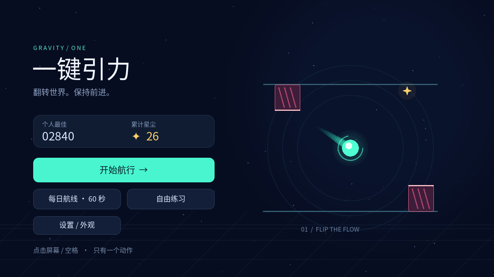
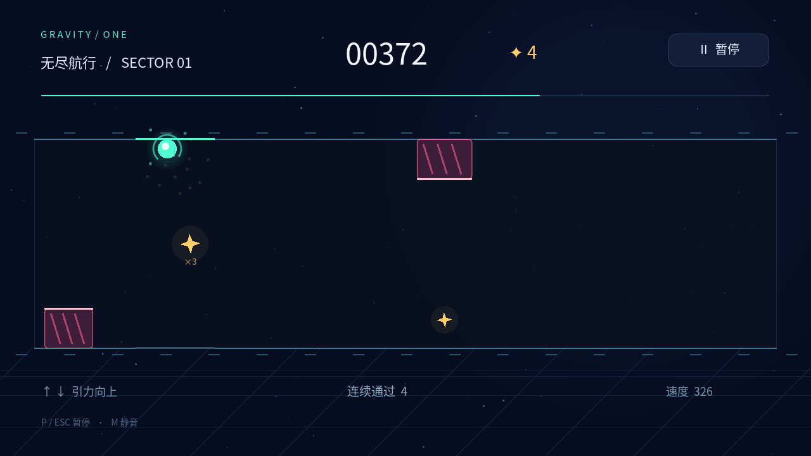

# 一键引力 · GRAVITY / ONE

**翻转世界，保持前进。** 一个只有一个核心动作的轻量街机游戏：引力核心自动前进，点击或按空格，在上下轨道之间翻转，避开珊瑚红障碍，收集金色星尘。

使用 **Godot 4.6.3 / GDScript** 制作。无账号、无广告、无网络接口。



## 快速开始

### 从源码运行

1. 安装 Godot **4.6.3** 标准版（不需要 .NET）
2. 导入仓库根目录的 `project.godot`
3. 等待资源导入完成，按 **F6 / F5** 运行场景或项目

也可以在项目目录执行：

```bash
godot --editor --path .
godot --path .
```

项目不依赖 Asset Library 插件。中文字体、图形与音频素材均随源码附带。

### 独立桌面构建

- Windows x86-64：运行 `OneKeyGravity.exe`
- Linux x86-64：为 `OneKeyGravity.x86_64` 添加可执行权限后运行
- Windows 构建未进行代码签名。仅使用可信来源的发布包，并根据你所在设备的安全策略处理系统提示
- Android 使用单独的测试 APK；它不是商店正式发布包。安装与真机验证状态见 [测试报告](TEST_REPORT.md)

## 操作

| 操作 | 键盘 / 鼠标 | 触屏 |
|---|---|---|
| 翻转引力 | 空格、Enter 或点击空白处 | 单指轻点空白处 |
| 开始 / 再来一次 | 空格或 Enter，也可点击按钮 | 点击按钮 |
| 暂停 / 继续 | P 或 Esc，也可点击按钮 | 点击暂停 / 继续按钮 |
| 重新开始 | 暂停或结算时按 R | 点击重新开始按钮 |
| 静音 | M 或设置按钮 | 设置 → 声音 |

- 按住按键不会连续翻转；极快重复输入有 85 毫秒防抖
- 第二根手指不会触发额外翻转，也不会将触摸再次模拟成鼠标点击
- 切换窗口、进入后台时自动暂停；恢复后有 **1 秒缓冲**
- Android 返回键在游戏中暂停，在暂停界面继续，在其他界面返回主菜单

## 三种航行方式

- **无尽航行**：逐渐加速，最高速度 440；挑战更远的距离和更高得分
- **每日航线**：按 **UTC 日期**生成相同种子的路线，坚持 60 秒完成挑战。它是本地每日挑战，没有在线排行榜
- **自由练习**：速度固定为 285，碰撞给出短暂无敌保护，不结束游戏

每份普通星尘增加 25 分；中间通道的 `×3` 星尘增加 3 份星尘。其余分数来自距离。结束的航行会在本机保存最佳分数与累计星尘。

累计星尘可解锁三种核心外观：薄荷（0）、紫晶（20）、琥珀（60）。设置中可切换静音与低特效。



## 手感与显示设计

- 120 Hz 固定物理步长；每次翻转立即改变运动方向
- 障碍一次只封锁一侧轨道，相邻障碍留出完整换轨时间
- 玩家碰撞半径小于可见外圈，光晕不会导致额外碰撞
- 全部屏幕使用相同的 16:9 逻辑舞台。4:3、超宽屏与竖屏会留边，不增加障碍预览距离
- **手机建议横屏**。竖屏仍可操作，但菜单和文字会缩小，不是独立竖屏布局
- 暂停、设置和重试都有明确按钮；核心玩法不依赖声音提示

## 复现测试

### 逻辑回归

```bash
godot --headless --path . --audio-driver Dummy --script tests/test_game.gd
```

测试不会保存玩家进度。覆盖键盘 / 鼠标 / 合成触摸、二指过滤、防抖、暂停 / 后台、重开、碰撞、得分、每日挑战、确定性种子和解锁。

### 真实渲染截图

需要可用的图形显示环境；不要添加 `--headless`：

```bash
godot --path . --audio-driver Dummy --rendering-method gl_compatibility \
  --script tests/capture_screens.gd
```

PNG 保存到 `screenshots/`。这些截图由 Godot 的真实视口纹理生成，并非图片模拟。

### 渲染性能参考

```bash
godot --path . --audio-driver Dummy --rendering-method gl_compatibility \
  --script tests/benchmark_render.gd
```

预热后记录 300 个实际渲染帧的墙钟间隔。测试机器、驱动和限制见 [测试报告](TEST_REPORT.md)；数据不能替代 Android 真机帧率。

## 导出

安装与编辑器版本相同的 Godot 4.6.3 导出模板，在“项目 → 导出”中选择预设：

- `Windows Desktop` → `build/windows/OneKeyGravity.exe`
- `Linux` → `build/linux/OneKeyGravity.x86_64`
- `Android` → `build/android/OneKeyGravity-test.apk`

Android 还需要配置 OpenJDK、Android SDK 和测试签名环境。正式发布应使用自己的包名与发行签名，切勿提交密钥。当前 Android 预设不请求互联网、网络状态或振动权限。

`tests/export_desktop.sh` 提供桌面批量导出；可通过 `GODOT`、`GODOT_DATA_HOME` 等环境变量指定本机工具链。源码目录不需要包含编辑器、SDK、导出模板或构建产物。

## 项目结构

```text
project.godot             项目设置
main.tscn / main.gd        主场景、游戏逻辑与界面
assets/                   字体、图标、音乐与音效
export_presets.cfg        Windows / Linux / Android 导出预设
tests/                    回归、真实渲染、性能与构建脚本
screenshots/              实际引擎截图
TEST_REPORT.md            验证结果与已知限制
```

## 许可

游戏代码、原创矢量图形与程序生成音频采用 [MIT](LICENSE)。随附中文字体使用 SIL Open Font License 1.1。Godot 引擎及第三方组件的声明见 [THIRD_PARTY_NOTICES.md](THIRD_PARTY_NOTICES.md)。

## 轻量字体 / ARM64 构建

当前源码使用重命名的字体子集 Gravity One UI（中文与 ASCII）及 Gravity One Symbols（重试与星尘符号）。全部界面字符均有显式内嵌字形，不依赖操作系统字体。完整原版字体构建仍保留为先前下载包。许可和修改说明位于 assets/。

Android 预设面向 ARM64；轻量测试 APK 使用优化引擎模板和测试用途签名，未进行真机安装验证。
